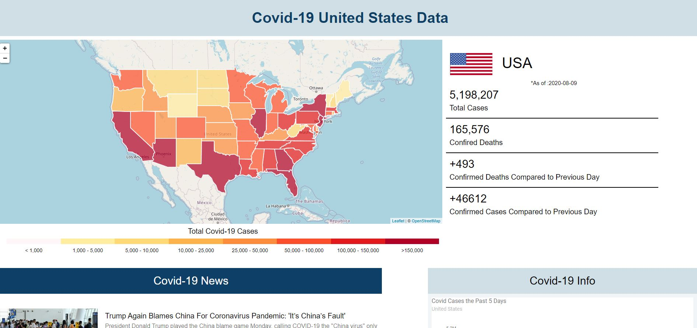

# Covid 19 Tracker

   
  
  ## Description
  
  This application is to help centralize data about the covid-19 virus in the United States. It displays the latest news regarding the virus from various new sources allowing users to have the most up to date information the media is providing. The application also allows users to select states on the map to pull the latest numbers about the virus including: confirmed virus counts, confirmed deaths, deaths compared to previous day, and cases compared to previous day. If users would like to get more details about a specific state they can select the view state details button after making a selection on the map. The individual state page will provide information about the governor is, population, twitter handle, and recent virus numbers. If the user is wants to find a local health facility, they can enter in their county and will be prompted with location and contact details to reach out.  
  
      You can see the application in action at https://covid1-9app.herokuapp.com/
  
  ## Table of Contents

  * [Installation](#installation)

  * [Usage](#usage)
  
  * [Images](#images)
  
  * [Author](#author)
  
  
  

  ## Installation

  Download application on your local system. Go to root of application and install dependencies by typing 'npm install' in your terminal. Once install is complete, type 'npm start' and go to the localhost provided in the terminal.

  ## Usage

  To use the application select the state you want covid-19 data on. If you want more specific state details such as : governor info, twitter info, population, or local state health facility contact information then select the state details button. To read up-to-date news about the virus you can select an article under the map on the main page.
   
  ## Images
  ### Landing Page
    
  ### Landing Page gif
      
  ### State page
  
  ### State Page gif
  
  
  ## Author
  
  Michael Emmons
  
  
